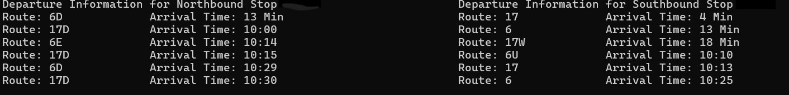

# MetroTransitDisplay
Creates a terminal display for real-time bus stop information, specifically using the MetroTransit API for the Metro Transit system in Minneapolis, MN. 

## Code Overview
The code is relatively simple, just displaying the route numbers and their departure times for the next 6 buses. The idea is top use this as a makeshift display, with it displaying the information for the 2 closest stops in both directions. This can be easily modified to only contain information for one stop, or more. As python does not have the best graphical support, it just prints the display info to the terminal, pauses 20 seconds, and then clears the terminal and updates. 

### Sample Display

Display information with stop numbers redacted